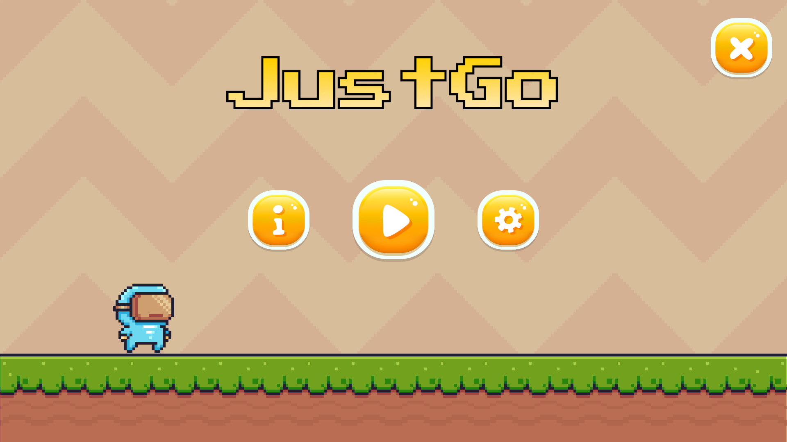
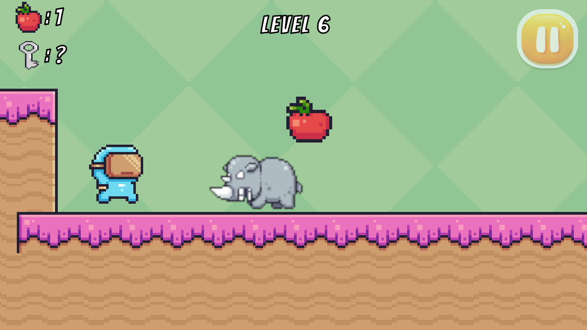

# JustGo 🏃‍♂️💨

**A Hard Game. Think you can speedrun it? Try it on!**

---

## 📸 Gameplay Screenshots
<table>
  <tr>
    <td width="50%"></td>
    <td width="50%"></td>
  </tr>
</table>

*So, do you dare to take the challenge?*

---

## 📝 Game Description
**JustGo** is a super challenging platformer game specifically designed to test your agility, reflexes, and patience. Packed with intense obstacles and unpredictable traps, this game serves as the perfect arena for **Speedrun** enthusiasts. 

Do you have the nerves of steel and precise execution required to beat this game without rage quitting? Prove your skills and set your best time!

> 💡 **Fun Fact:** This game was fully developed by a **Solo Developer**, handling everything from C# programming logic, level design, UI Canvas architecture, to dynamic 3D Spatial Audio implementation.

---

## 🎮 Controls

Navigate your character using these standard PC controls:

| Key | Action / Function |
| :---: | --- |
| **W** | Move Forward / Jump |
| **A** | Move Left |
| **S** | Move Backward / Down |
| **D** | Move Right |

---
Developed with ❤️ using **Unity Engine**.
